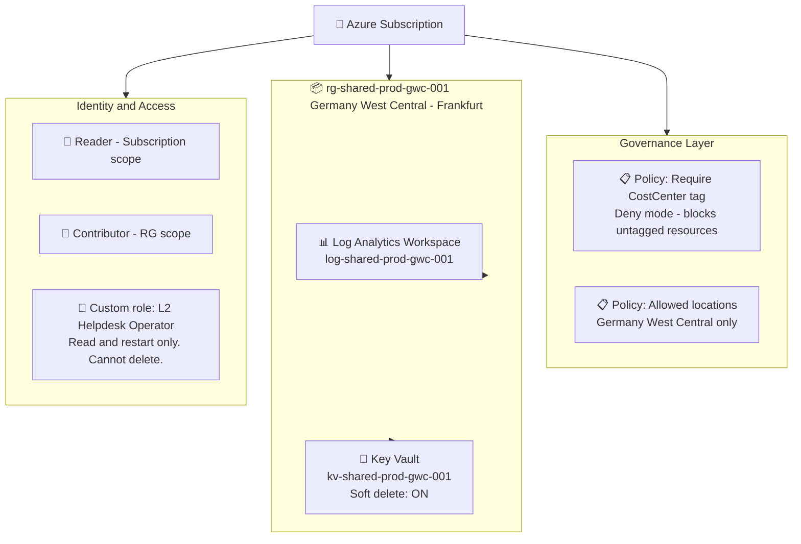
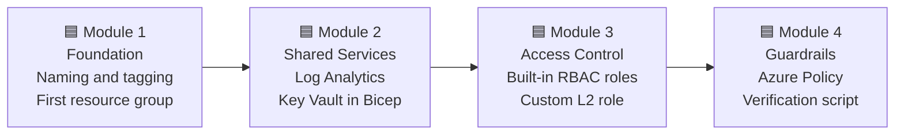

# ☁️ Azure Infrastructure Foundation - Hessler Logistik GmbH

---

> A lot of people are using AI to generate portfolios right now.
> I am doing something different.
> I am currently studying full time for AZ-104 and CompTIA Security+.
> This project is part of that preparation. I build it alongside my studies, step by step.
> Every command here I actually ran. Every bug documented here I actually hit.
> Every screenshot was taken by me from my own Azure account.
> This is not a generated walkthrough. This is me learning in public and proving it.

---

> **Status:** In progress. I am currently studying full time for **AZ-104 and CompTIA Security+**.
> I build this project in parallel with my studies, module by module.
> The commit history reflects the real pace of that work.

---

## ☁️ What is this project

**The company:** Hessler Logistik GmbH. Fictional. 30 people. Freight forwarding. Frankfurt.
They have been running on an old on-premises Windows Server for years and are now moving their first workloads to Azure.

**The role I am playing:** Junior cloud admin. Hired to set up the foundation before anyone else deploys anything.

**The problem:** Most tutorials skip this part. They jump straight to deploying VMs and databases because that is more exciting to watch. But skipping the foundation is exactly *what causes runaway costs, audit failures, and naming chaos six months later*.

**What I am doing instead:** Building the foundation first.

> Clean resource group structure. Naming convention. Mandatory tags. RBAC with least privilege. Azure Policy guardrails. All of it in **Bicep** so it deploys with one command, *not a hundred portal clicks*.

---

## ☁️ What I am building

Here is the full picture of what this foundation looks like when all four modules are done.

---

## ☁️ How I am building it

Four modules. Building them one at a time.

| Module | Status | What gets built |
| :--- | :--- | :--- |
| **1. Foundation** | 🔄 In progress | Subscription audit, naming convention, first resource group with full tag set |
| **2. Shared Services** | 📅 Planned | Bicep modules for Log Analytics workspace and Key Vault |
| **3. Access Control** | 📅 Planned | Built-in roles at correct scopes plus one custom L2 helpdesk role |
| **4. Guardrails** | 📅 Planned | Tag policy, location policy, PowerShell verification script |

---

## ☁️ What is in this repository

| File or folder | What it is |
| :--- | :--- |
| `docs/01-NAMING-CONVENTION.md` | Source of truth for every resource name in this project |
| `docs/02-TAGGING-POLICY.md` | The seven mandatory tags and why each one exists |
| `bicep/main.bicep` | Subscription-scope entry point for the whole deployment |
| `bicep/modules/log-analytics.bicep` | Bicep module for the central Log Analytics workspace |
| `bicep/modules/key-vault.bicep` | Bicep module for Key Vault with soft delete enabled |
| `bicep/modules/custom-role-l2.json` | Custom RBAC role definition for L2 helpdesk operators |
| `policies/` | Azure Policy definitions for tag enforcement and location restriction |
| `scripts/Verify-Foundation.ps1` | PowerShell health check script with PASS/FAIL output |
| `screenshots/` | Visual evidence from each module |

---
