# ☁️ Azure Infrastructure Foundation - Hessler Logistik GmbH


---

> A lot of people are using AI to generate portfolios right now.
> I am doing something different.
> I am currently studying full time for AZ-104 and CompTIA Security+.
> This project is part of that preparation. I build it alongside my studies, step by step.
> Every command here I actually ran. Every bug documented here I actually hit.
> Every screenshot was taken by me from my own Azure account.
> This is not a generated walkthrough. This is me learning in public and proving it.

---

> **Status:** In progress. I am currently studying full time for **AZ-104 and CompTIA Security+**.
> I build this project in parallel with my studies, module by module.
> The commit history reflects the real pace of that work.

---

## ☁️ What is this project

**The company:** Hessler Logistik GmbH. Fictional. 30 people. Freight forwarding. Frankfurt.
They have been running on an old on-premises Windows Server for years and are now moving their first workloads to Azure.

**The role I am playing:** Junior cloud admin. Hired to set up the foundation before anyone else deploys anything.

**The problem:** Most tutorials skip this part. They jump straight to deploying VMs and databases because that is more exciting to watch. But skipping the foundation is exactly *what causes runaway costs, audit failures, and naming chaos six months later*.

**What I am doing instead:** Building the foundation first.

> Clean resource group structure. Naming convention. Mandatory tags. RBAC with least privilege. Azure Policy guardrails. All of it in **Bicep** so it deploys with one command, *not a hundred portal clicks*.

---

## ☁️ What I am building

Here is the full picture of what this foundation looks like when all four modules are done.

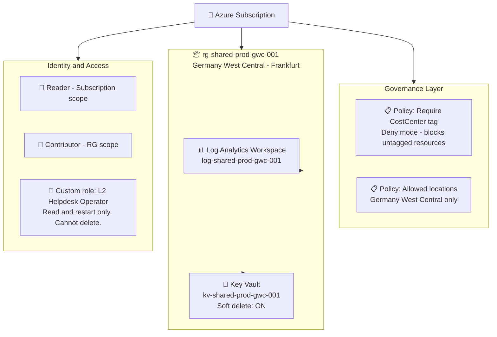

---

## ☁️ How I am building it

Four modules. Building them one at a time.

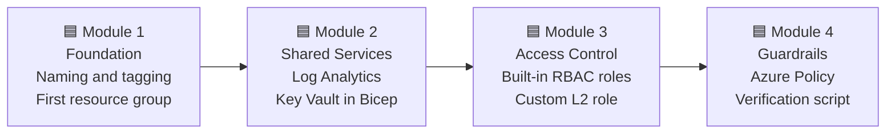

| Module | Status | What gets built |
| :--- | :--- | :--- |
| **1. Foundation** | 🔄 In progress | Subscription audit, naming convention, first resource group with full tag set |
| **2. Shared Services** | 📅 Planned | Bicep modules for Log Analytics workspace and Key Vault |
| **3. Access Control** | 📅 Planned | Built-in roles at correct scopes plus one custom L2 helpdesk role |
| **4. Guardrails** | 📅 Planned | Tag policy, location policy, PowerShell verification script |

---

## ☁️ What is in this repository

| File or folder | What it is |
| :--- | :--- |
| `docs/01-NAMING-CONVENTION.md` | Source of truth for every resource name in this project |
| `docs/02-TAGGING-POLICY.md` | The seven mandatory tags and why each one exists |
| `bicep/main.bicep` | Subscription-scope entry point for the whole deployment |
| `bicep/modules/log-analytics.bicep` | Bicep module for the central Log Analytics workspace |
| `bicep/modules/key-vault.bicep` | Bicep module for Key Vault with soft delete enabled |
| `bicep/modules/custom-role-l2.json` | Custom RBAC role definition for L2 helpdesk operators |
| `policies/` | Azure Policy definitions for tag enforcement and location restriction |
| `scripts/Verify-Foundation.ps1` | PowerShell health check script with PASS/FAIL output |
| `screenshots/` | Visual evidence from each module |

---

# ☁️ Module 1 - Foundation: naming, tagging, first resource group

Before any Azure resource exists, I want a naming convention written down, mandatory tags defined, and the first resource group created the right way. Everything else builds on top of this.

Here is what this module does from start to finish:

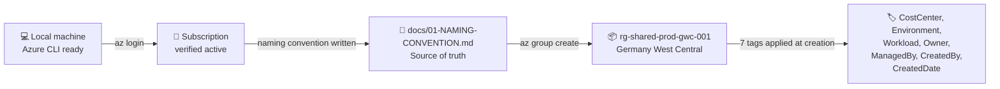

---

### 🟦 Step 0: Install the tools and set up the repo

Before writing any Azure commands, I made sure the tools were installed and the GitHub repo was ready.

**Installing the tools:**

```powershell
winget install Microsoft.AzureCLI
winget install Microsoft.Bicep
winget install GitHub.cli
winget install Git.Git
winget install Microsoft.PowerShell
```

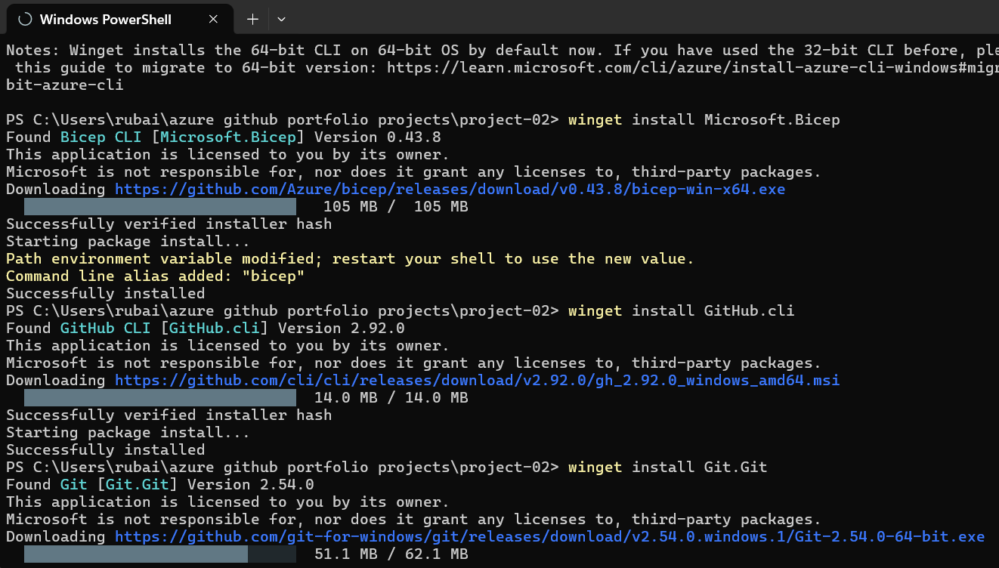
*Downloading and installing the required tools via winget.*

After installing, I closed and reopened PowerShell so the PATH refreshed, then verified every tool responded correctly:

```powershell
az version
az bicep version
gh --version
git --version
$PSVersionTable.PSVersion
```

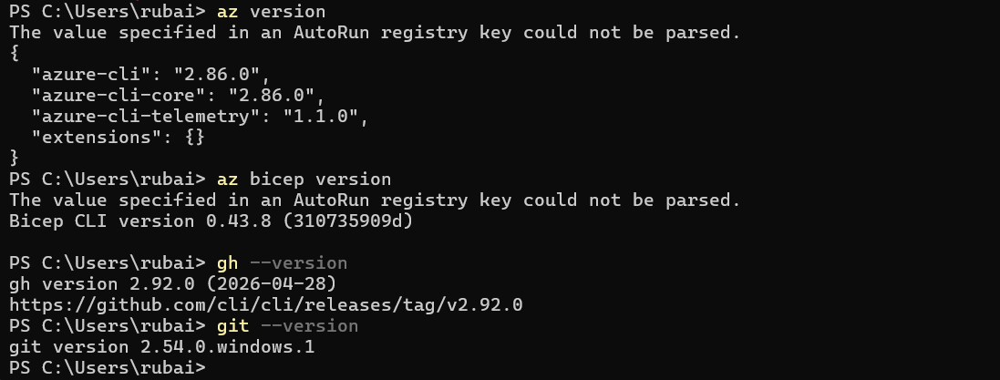
*All five tools confirmed installed and returning version numbers. Azure CLI, Bicep, gh CLI, Git, and PowerShell 7 all present.*

Then signed in to Azure:

```powershell
az login
```

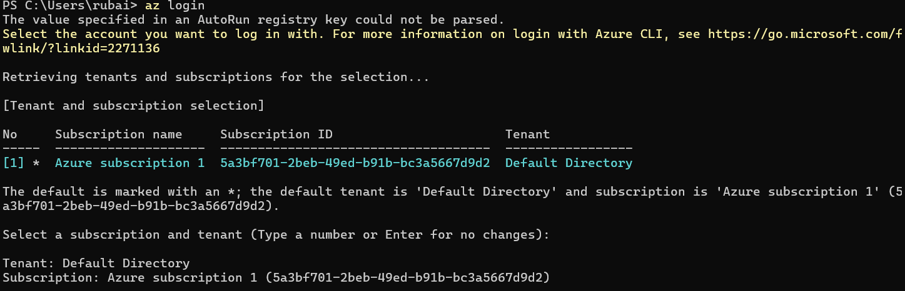
*Signed in to Azure via browser. CLI confirmed the account and active subscription.*

**Creating the GitHub repo and folder structure:**

```powershell
gh repo create azure-iac-foundation --public `
  --description "Azure landing zone foundation for a German SME with Bicep, RBAC, Azure Policy and verification. AZ-104 aligned."

git clone https://github.com/rubak714/azure-iac-foundation.git
cd azure-iac-foundation

New-Item -ItemType Directory -Path `
  bicep, bicep\modules, scripts, docs, screenshots, `
  policies, .github\ISSUE_TEMPLATE | Out-Null
```

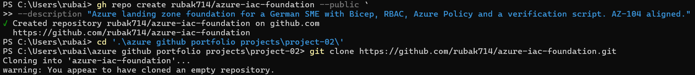
*GitHub repo created via gh CLI. Public, with description set.*

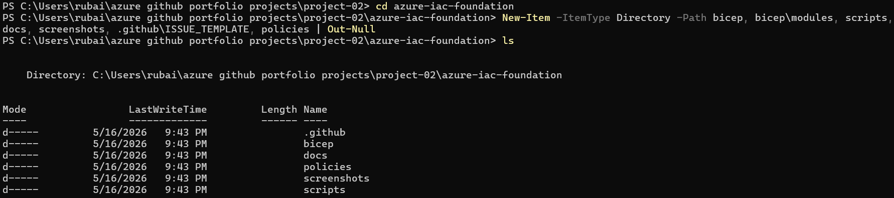
*Folder structure created locally. All seven directories visible.*

---

### 🟦 Step 1: Verify the correct subscription is active

The most common mistake new Azure admins make is running commands in the wrong subscription. Then they spend an hour wondering where their resources went.

I check this every single session before doing anything else.

```powershell
az account show --output table
```

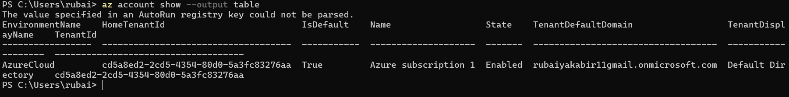
*Confirmed the correct subscription is active before creating anything. Subscription name and state are visible. Tenant ID and subscription ID are cropped because they are sensitive.*

Then I checked which German regions Azure offers. Hessler Logistik is a German company. DSGVO requires that data stays inside the European Union. Germany West Central in Frankfurt is the primary region for this project because it has a wider service catalogue than Germany North in Berlin.

```powershell
az account list-locations `
  --query "[?contains(name, 'germany')].{Name:name, DisplayName:displayName}" `
  --output table
```

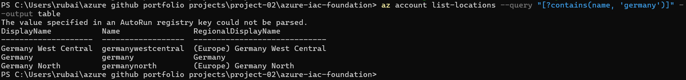
*Two German Azure regions shown: Germany West Central (Frankfurt) and Germany North (Berlin). Frankfurt is the primary choice for this project.*

I also captured my signed-in user details at this point. The object ID from this output is needed later in Module 3 for RBAC assignments. I saved it in a local note and did not commit it to the repo.

```powershell
az ad signed-in-user show `
  --query "{id:id, mail:mail, displayName:displayName, upn:userPrincipalName}" `
  --output json
```

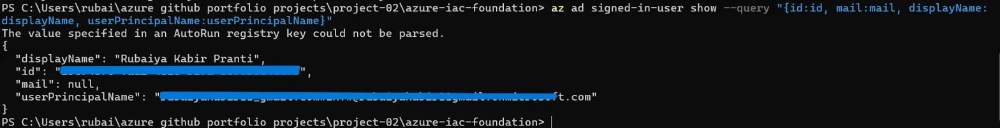
*Signed-in user details confirmed. Email and object ID are hided because they are sensitive. Object ID saved locally for use in Module 3.*

---

### 🟦 Step 2: Write the naming convention before creating anything

This is the document most people skip. It is also the document that saves everyone time six months later when nobody can figure out what `temp-rg-v2-final` does.

I wrote this before creating a single resource. It is the source of truth for every name in this project.

**The pattern:**

```
<resource-type>-<workload>-<environment>-<region>-<instance>
```

| Token | Values I am using |
| :--- | :--- |
| resource-type | `rg`, `vnet`, `snet`, `vm`, `kv`, `log`, `nsg`, `pip` |
| workload | `shared`, `freight`, `web`, `identity` |
| environment | `dev`, `test`, `prod`, `sandbox` |
| region | `gwc` for Frankfurt, `gn` for Berlin |
| instance | `001`, `002`, and so on |

**Examples from this project:**

| Resource | Name |
| :--- | :--- |
| Shared services resource group | `rg-shared-prod-gwc-001` |
| Log Analytics workspace | `log-shared-prod-gwc-001` |
| Key Vault | `kv-shared-prod-gwc-001` |
| Future production VM | `vm-freight-prod-gwc-001` |

**Storage accounts are an exception.** Azure requires them to be globally unique, all lowercase, no hyphens, between 3 and 24 characters. I use this pattern for them: `st` + workload + environment + `gwc` + 4 random characters. Example: `stsharedprodgwc7a2b`.

The full specification is in [docs/01-NAMING-CONVENTION.md](docs/01-NAMING-CONVENTION.md).

---
